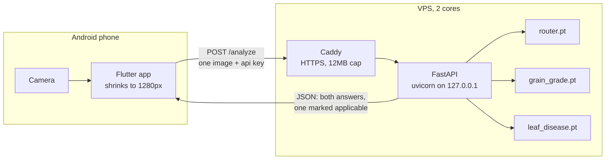
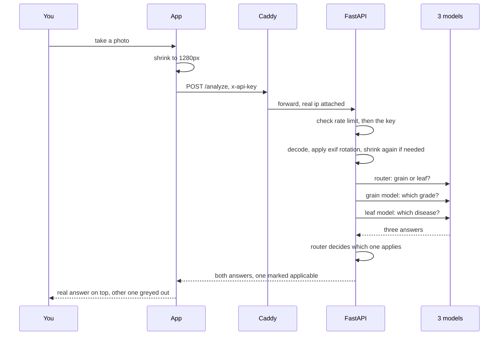
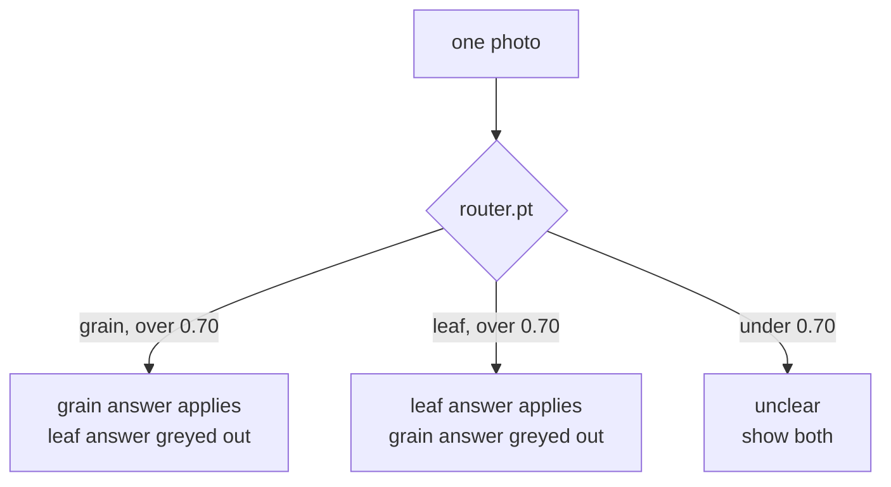

# How it works

The phone takes a photo and shows an answer. Everything between those two things happens on
the server.

## The pieces

The phone runs no model. It captures, shrinks, uploads and draws the reply. That is why the app
needs a connection and why the server address is compiled into the apk instead of being a
setting.

Port 8000 is never open to the internet. Caddy is the only thing that talks to it.

## What happens to one photo

The rate limit runs before the key check, so a flood of requests with no key still gets
throttled instead of being cheap to repeat.

## Why there are three models and not two

The app only asks for one photo. Neither result model can refuse an image it was not built for,
so if you photograph a leaf the grain model still returns a confident grade.

That is not a small problem. On a real leaf photo the grain model returned stained at 0.9999
while the leaf model correctly returned brown spot. The wrong answer was more confident than
the right one.

So a third model decides which answer applies, and the response marks it. The app shows the one
that applies and greys out the other. You cannot work this out from the confidence numbers,
which is the whole reason applicable is a separate field.

## Accuracy

Held out test accuracy was 0.8427 for grain, 0.9675 for leaf, 1.0000 for the router.

The number the app shows you is not that. It is confidence, which is how sure the model was
about that one photo. A wrong answer can be just as confident as a right one, as above.

The leaf figure also needs care. On photo sets the model had never seen it drops to between
0.44 and 0.60. A photo taken at a mill is a new set.

## What is not here

No database. No file storage. No queue. The uploaded photo is decoded in memory, written to a
temp file for the models, and deleted straight after. Nothing about a request survives it.

One worker on purpose. The models take about 1.5GB of memory and inference is cpu bound on two
cores, so a second worker would just fight the first one for the same cores. It also keeps the
rate limiter correct, since it counts requests per ip in memory and a second worker would keep
its own separate count.
